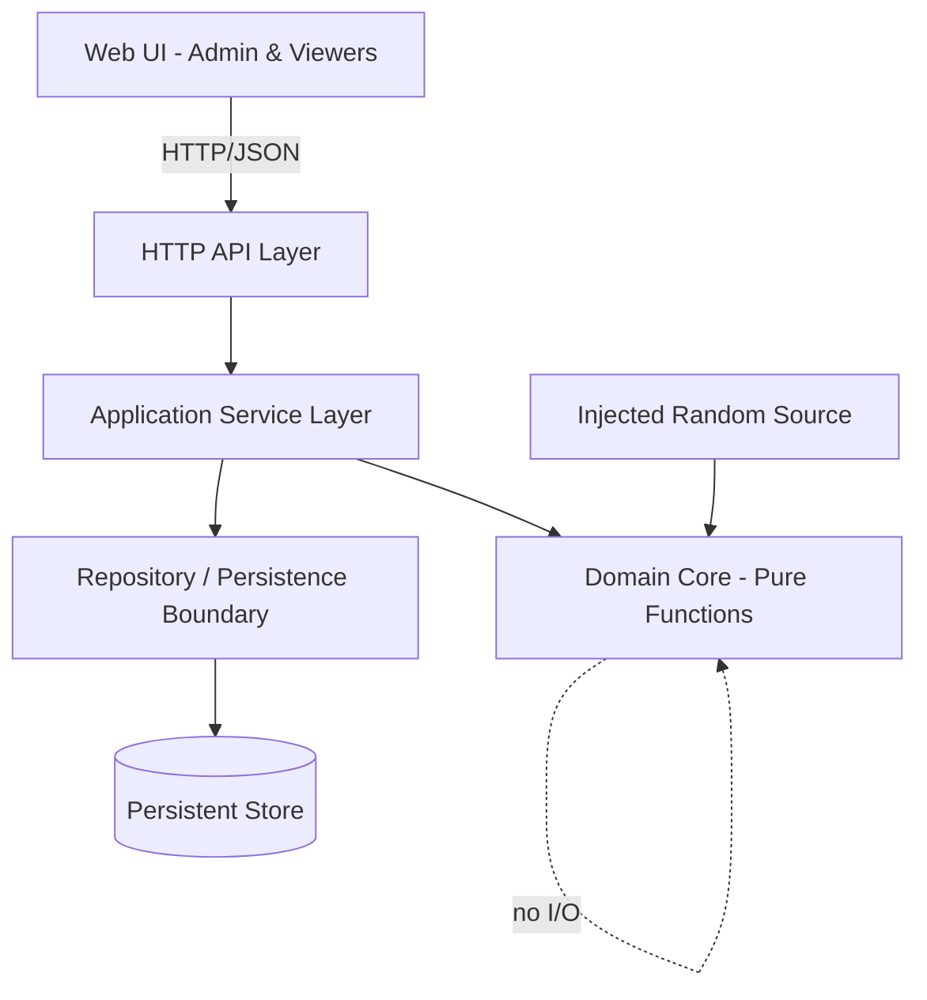
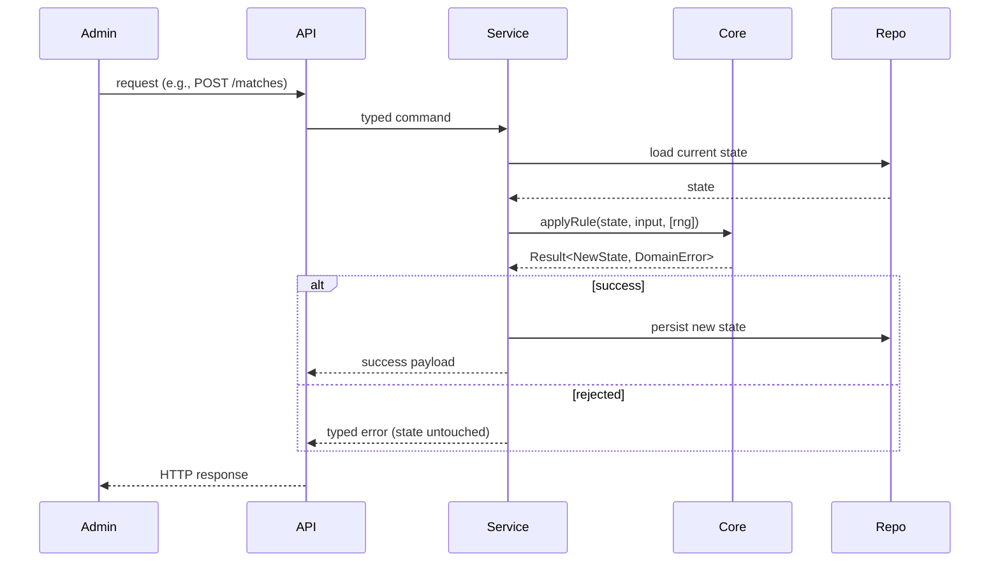

# Design Document

## Overview

The World Cup Sweepstake is an internal web tool that lets a team run a friendly competition around a World Cup tournament. Administrators maintain a list of participants and competing nations, randomly assign nations to participants, record match results, and let the system compute a points-based league table and two prize winners.

The design separates the system into three layers:

1. **Domain Core** — pure, side-effect-free functions and immutable value objects that encode all the rules: name validation, fair random assignment, match validation, points calculation, league ranking, and prize determination. This layer is the heart of the system and the primary target for property-based testing.
2. **Application/Service Layer** — orchestrates domain operations against a persistence boundary, manages state transitions (e.g., "assignments exist" gating participant removal), and exposes use cases to the interface layer.
3. **Interface Layer** — an HTTP API plus a thin web UI for administrators and participants to view standings.

A central design decision is to keep all rule logic in pure functions that take the current state and an input and return a new state plus a result (success or a typed error). This makes the rules deterministic (the random assignment takes an explicit RNG/seed), easy to test exhaustively with generated inputs, and independent of storage and UI choices.

### Key Design Decisions

- **Pure domain core with explicit state.** All calculations (points, league table, prizes) are derived as pure functions of the stored data (participants, nations, assignments, matches, champion). Nothing is cached in a way that can drift; standings are always recomputed from the complete current set of matches, satisfying Requirement 5.6 and 6.7 without invalidation bugs.
- **Injected randomness.** The Assignment_Engine receives a random source so production uses a cryptographically seeded PRNG while tests inject deterministic or statistically analyzable sources. This makes the uniform-distribution requirement (3.4) testable.
- **Typed results over exceptions for domain errors.** Validation and rule violations return discriminated-union error values rather than throwing, so every rejection path is explicit and testable, and "leave state unchanged on rejection" (1.2, 1.3, 1.4, 2.2, 2.3, 3.5, 3.6, 3.7, 4.7) is structurally guaranteed.
- **Case-insensitive, trimmed identity for names.** Participant and Nation names are compared case-insensitively after trimming. A normalized form is stored alongside the original display name to enforce uniqueness consistently.

## Architecture



Request flow for a state-changing operation (e.g., add participant, record match):



### Technology Choice

The reference implementation targets **TypeScript** running on Node.js for the service/API and a lightweight web UI, because:

- A single language across domain core, API, and UI reduces duplication of the rules.
- TypeScript's discriminated unions express the typed-result pattern cleanly.
- The ecosystem has a mature property-based testing library (**fast-check**) that integrates with the standard test runner.

The domain core has zero dependencies on the web or storage frameworks, so the same rules could be hosted differently without change. Persistence for an internal-scale tool is a single serialized state document (JSON file or a small embedded/managed store); the repository interface hides this choice.

## Components and Interfaces

### Domain Core (pure)

- **NameValidation**
  - `normalizeName(raw: string): string` — trims and lowercases for comparison.
  - `validateName(raw: string): Result<ValidName, NameError>` — enforces 1–100 chars after trimming; returns `EMPTY` or `TOO_LONG` errors.
- **ParticipantRules**
  - `addParticipant(state, rawName): Result<State, ParticipantError>` — validates, checks case-insensitive uniqueness, appends.
  - `removeParticipant(state, participantId): Result<State, ParticipantError>` — rejects when assignments exist or participant not found.
- **NationRules**
  - `addNation(state, rawName): Result<State, NationError>` — validates and enforces uniqueness.
  - `removeNation(state, nationId): Result<State, NationError>` — allowed only before assignments exist.
- **Assignment_Engine**
  - `assign(state, rng, confirmReplace): Result<State, AssignmentError>` — produces a uniformly random valid distribution covering all nations, balanced to within 1 per participant.
- **Match_Recorder**
  - `recordMatch(state, input): Result<State, MatchError>` — validates distinct known nations and goal counts 0–99.
  - `updateMatch(state, input): Result<State, MatchError>` — replaces an existing match identified by its nation pair.
- **Scoring**
  - `nationPoints(matches, nationId): number` — win/draw points plus goal points across all matches for a nation.
  - `participantPoints(state, participantId): number` — sum over assigned nations.
- **LeagueTable**
  - `buildLeagueTable(state): LeagueTable` — ranked rows with ties handled.
- **Prizes**
  - `recordChampion(state, nationId): Result<State, ChampionError>`
  - `tournamentWinner(state): Result<ParticipantRef, ChampionStatus>`
  - `leaguePrize(state): Result<ParticipantRef[], LeagueStatus>`

### Application Service Layer

Each use case: load state, call the corresponding pure core function, persist on success, translate the typed result to an interface response. The service also tracks lifecycle flags derived from state (assignments exist, champion recorded, league finalized).

### Interface Layer (HTTP API)

| Method & Path | Purpose | Requirements |
|---|---|---|
| `POST /participants` | Add participant | 1.1–1.4 |
| `DELETE /participants/{id}` | Remove participant | 1.5–1.7 |
| `GET /participants` | List participants | 1.8 |
| `POST /nations` | Add nation | 2.1–2.3 |
| `DELETE /nations/{id}` | Remove nation | 2.4 |
| `GET /nations` | List nations | 2.5 |
| `POST /assignments` | Run/replace assignment | 3.1–3.8 |
| `GET /assignments` | View assignments | 3.9 |
| `POST /matches` | Record match | 4.1–4.4, 4.7 |
| `PUT /matches` | Update match | 4.5–4.7 |
| `GET /matches` | List matches | 4.8 |
| `GET /league-table` | View standings | 6.1–6.7 |
| `POST /champion` | Record champion | 7.1–7.4 |
| `GET /prizes/tournament-winner` | Tournament winner prize | 7.5–7.6 |
| `POST /league/finalize` + `GET /prizes/league` | League prize | 8.1–8.5 |

State-changing endpoints return a typed error body with a stable `code` field on rejection and never mutate state.

## Data Models

```typescript
type Id = string; // opaque unique identifier

interface Participant {
  id: Id;
  displayName: string;   // original, trimmed
  normalizedName: string; // lowercased trimmed, for uniqueness & sort
}

interface Nation {
  id: Id;
  displayName: string;
  normalizedName: string;
}

// Exactly one participant per nation; a participant may hold many nations.
interface Assignment {
  nationId: Id;
  participantId: Id;
}

interface Match {
  // Identity is the unordered pair {nationAId, nationBId}.
  nationAId: Id;
  nationBId: Id;     // distinct from nationAId
  goalsA: number;    // integer 0..99
  goalsB: number;    // integer 0..99
}

interface SweepstakeState {
  participants: Participant[];
  nations: Nation[];
  assignments: Assignment[];   // empty until assignment is run
  matches: Match[];            // unordered pair is unique key
  championNationId: Id | null;
  leagueFinalized: boolean;
}

// Derived (not stored)
interface LeagueRow {
  participantId: Id;
  displayName: string;
  totalPoints: number;
  rank: number; // count of participants with strictly greater points + 1
}
type LeagueTable = LeagueRow[]; // ordered by points desc, then name asc (ci)

// Result and error shapes
type Result<T, E> =
  | { ok: true; value: T }
  | { ok: false; error: E };

type DomainError =
  | { code: "NAME_REQUIRED" }
  | { code: "NAME_TOO_LONG" }
  | { code: "DUPLICATE_PARTICIPANT" }
  | { code: "DUPLICATE_NATION" }
  | { code: "ASSIGNMENTS_EXIST" }
  | { code: "PARTICIPANT_NOT_FOUND" }
  | { code: "NO_PARTICIPANTS" }
  | { code: "NO_NATIONS" }
  | { code: "CONFIRMATION_REQUIRED" }
  | { code: "UNKNOWN_NATION"; nation: string }
  | { code: "NATIONS_NOT_DISTINCT" }
  | { code: "GOALS_OUT_OF_RANGE" }
  | { code: "MATCH_NOT_FOUND" }
  | { code: "CHAMPION_NOT_ASSIGNED" }
  | { code: "CHAMPION_NOT_RECORDED" }
  | { code: "LEAGUE_NOT_FINALIZED" };
```

**Match identity.** A match is keyed by the unordered pair of nation ids. Recording or updating normalizes the pair so `{A,B}` and `{B,A}` refer to the same match. Update (4.5) replaces goals for the existing pair; recording a pair that already exists is treated per the recorder's create/update semantics defined in the service.

**Points are always derived.** No points are stored on participants or nations; `buildLeagueTable` and the scoring functions recompute from `matches` on every read, which is why add/update/remove of a match automatically yields correct recalculated totals (5.6).

## Correctness Properties

*A property is a characteristic or behavior that should hold true across all valid executions of a system — essentially, a formal statement about what the system should do. Properties serve as the bridge between human-readable specifications and machine-verifiable correctness guarantees.*

These properties were derived from the acceptance criteria via the prework analysis. Each is universally quantified and intended to be implemented as a single property-based test. Redundant criteria were consolidated (see notes inline).

### Property 1: Valid participant is added

*For any* state and any name that, after trimming, has length 1–100 and does not case-insensitively match an existing participant, adding the participant succeeds and yields a participant list that is exactly one longer and contains the normalized name.

**Validates: Requirements 1.1**

### Property 2: Duplicate participant names are rejected (case-insensitive, trimmed)

*For any* state containing a participant and *for any* name that equals that participant's name after trimming and case-folding (including differing case and surrounding whitespace), adding it is rejected with `DUPLICATE_PARTICIPANT` and the participant list is unchanged.

**Validates: Requirements 1.2**

### Property 3: Empty or whitespace participant names are rejected

*For any* string consisting solely of whitespace (including the empty string), adding it as a participant is rejected with `NAME_REQUIRED` and the participant list is unchanged.

**Validates: Requirements 1.3**

### Property 4: Over-length participant names are rejected

*For any* string whose length after trimming exceeds 100, adding it as a participant is rejected with `NAME_TOO_LONG` and the participant list is unchanged.

**Validates: Requirements 1.4**

### Property 5: Participant removal before assignments succeeds

*For any* state with no assignments and any existing participant, removing that participant yields a list that no longer contains them and is one shorter.

**Validates: Requirements 1.5**

### Property 6: Participant removal after assignments is rejected

*For any* state in which assignments exist and any participant, removing that participant is rejected with `ASSIGNMENTS_EXIST` and the participant list is unchanged.

**Validates: Requirements 1.6**

### Property 7: Removing a non-existent participant is rejected

*For any* state and any id not present in the participant list, removal is rejected with `PARTICIPANT_NOT_FOUND` and the participant list is unchanged.

**Validates: Requirements 1.7**

### Property 8: Valid nation is added

*For any* state and any name that, after trimming, has length 1–100 and does not case-insensitively match an existing nation, adding the nation succeeds and yields a nation list that is exactly one longer and contains the normalized name.

**Validates: Requirements 2.1**

### Property 9: Duplicate nation names are rejected (case-insensitive, trimmed)

*For any* state containing a nation and *for any* name equal to it after trimming and case-folding, adding it is rejected with `DUPLICATE_NATION` and the nation list is unchanged.

**Validates: Requirements 2.2**

### Property 10: Invalid nation names are rejected

*For any* name that is empty, whitespace-only, or longer than 100 characters after trimming, adding it as a nation is rejected with a validation error and the nation list is unchanged.

**Validates: Requirements 2.3**

### Property 11: Nation removal before assignments succeeds

*For any* state with no assignments and any existing nation, removing that nation yields a list that no longer contains it.

**Validates: Requirements 2.4**

### Property 12: Assignment covers every nation exactly once

*For any* non-empty participant list and non-empty nation list, running assignment produces a set of assignments whose nation ids equal the full nation set, with each nation assigned to exactly one participant and no nation unassigned.

**Validates: Requirements 3.1**

### Property 13: Every participant receives at least one nation when nations ≥ participants

*For any* non-empty lists where the number of nations is greater than or equal to the number of participants, the resulting assignment gives every participant at least one nation.

**Validates: Requirements 3.2**

### Property 14: Assignment is balanced to within one nation per participant

*For any* non-empty lists where nations exceed participants, the difference between the largest and smallest per-participant nation count in the resulting assignment is at most 1.

**Validates: Requirements 3.3**

### Property 15: Assignment is uniformly distributed and order-independent

*For any* fixed small participant and nation lists, sampling many assignments from the engine produces every valid distribution (those satisfying Properties 12–14) with empirically equal frequency within statistical tolerance, and permuting the insertion order of participants or nations does not change the distribution of outcomes.

**Validates: Requirements 3.4**

### Property 16: Assignment with no participants is rejected

*For any* state with an empty participant list, triggering assignment is rejected with `NO_PARTICIPANTS` and any existing assignments are unchanged.

**Validates: Requirements 3.5**

### Property 17: Assignment with no nations is rejected

*For any* state with an empty nation list, triggering assignment is rejected with `NO_NATIONS` and any existing assignments are unchanged.

**Validates: Requirements 3.6**

### Property 18: Re-assignment without confirmation is rejected

*For any* state where assignments already exist, triggering assignment without replacement confirmed is rejected with `CONFIRMATION_REQUIRED` and the existing assignments are unchanged.

**Validates: Requirements 3.7**

### Property 19: Confirmed re-assignment replaces existing assignments

*For any* state where assignments exist, triggering assignment with replacement confirmed discards the previous assignments and produces a new assignment set that still satisfies Properties 12–14.

**Validates: Requirements 3.8**

### Property 20: Valid match is recorded and retrievable

*For any* state with at least two nations, recording a match between two distinct existing nations with goal counts in 0–99 stores the match so it is retrievable by its unordered nation pair with the submitted goals.

**Validates: Requirements 4.1**

### Property 21: Matches referencing unknown nations are rejected

*For any* match in which at least one nation is not in the nation list, recording is rejected with `UNKNOWN_NATION` and the stored matches are unchanged.

**Validates: Requirements 4.2**

### Property 22: Matches with identical nations are rejected

*For any* match whose two nations are the same, recording is rejected with `NATIONS_NOT_DISTINCT` and the stored matches are unchanged.

**Validates: Requirements 4.3**

### Property 23: Out-of-range goal counts are rejected

*For any* match whose goal count for either nation is non-integer, less than 0, or greater than 99, recording is rejected with `GOALS_OUT_OF_RANGE` and the stored matches are unchanged.

**Validates: Requirements 4.4**

### Property 24: Updating an existing match replaces its result

*For any* stored match identified by its unordered nation pair, updating it with new valid goal counts replaces the stored goals with the new values and leaves the number of stored matches unchanged.

**Validates: Requirements 4.5**

### Property 25: Updating a non-stored match is rejected

*For any* nation pair with no stored match, updating is rejected with `MATCH_NOT_FOUND` and the stored matches are unchanged.

**Validates: Requirements 4.6, 4.7**

### Property 26: Win awards three win/draw points to the higher scorer only

*For any* match with unequal goal counts, the nation with the higher goal count receives exactly 3 win/draw points and the other receives 0 win/draw points for that match.

**Validates: Requirements 5.1**

### Property 27: Draw awards one win/draw point to each nation

*For any* match with equal goal counts, each nation receives exactly 1 win/draw point for that match.

**Validates: Requirements 5.2**

### Property 28: Goal points equal goal count

*For any* match, each nation's goal-point component equals that nation's goal count in the match.

**Validates: Requirements 5.3**

### Property 29: Nation total points equal the summed win/draw and goal points across its matches

*For any* set of stored matches and any nation, the nation's total points equal the sum, over every match the nation played, of its win/draw points plus its goal points (verified against an independent reference computation).

**Validates: Requirements 5.4**

### Property 30: Participant total points equal the sum of assigned nations' totals

*For any* assigned state and set of matches, a participant's total points equal the sum of the total points of that participant's assigned nations, and equal 0 when none of the assigned nations have stored match results.

**Validates: Requirements 5.5**

### Property 31: Points depend only on the current match set, not history

*For any* two sequences of record/update/remove operations that result in the same final set of stored matches, the computed participant totals are identical.

**Validates: Requirements 5.6**

### Property 32: League table covers every participant exactly once

*For any* state, the league table contains exactly one row per participant in the participant list, each carrying that participant's computed total points, and is empty when the participant list is empty.

**Validates: Requirements 6.1, 6.6**

### Property 33: League ranks are defined by strictly-greater point counts

*For any* league table, each participant's rank equals the number of participants with strictly greater total points plus 1; consequently rows are ordered by total points from highest to lowest and participants with equal points share the same rank.

**Validates: Requirements 6.2, 6.4, 6.5**

### Property 34: Ties are ordered by case-insensitive ascending name

*For any* league table, among participants with equal total points the rows appear in non-decreasing case-insensitive name order.

**Validates: Requirements 6.3**

### Property 35: An assigned champion identifies its holder

*For any* assigned state, recording a champion that is assigned to a participant identifies exactly that single participant as the Tournament_Winner_Prize recipient.

**Validates: Requirements 7.1**

### Property 36: An unknown champion nation is rejected

*For any* state, recording a champion nation that is not in the nation list is rejected with `UNKNOWN_NATION` and the state is unchanged.

**Validates: Requirements 7.2**

### Property 37: A champion present but unassigned is rejected

*For any* state containing a nation that exists but has no assignment, recording it as champion is rejected with `CHAMPION_NOT_ASSIGNED` and the state is unchanged.

**Validates: Requirements 7.3**

### Property 38: Recording a new champion replaces the previous one

*For any* state, recording a champion after one has already been recorded results in the Tournament_Winner_Prize recipient corresponding only to the most recently recorded champion.

**Validates: Requirements 7.4**

### Property 39: Tournament winner is unavailable until a champion is recorded

*For any* state with no champion recorded, requesting the Tournament_Winner_Prize recipient returns a `CHAMPION_NOT_RECORDED` status.

**Validates: Requirements 7.6**

### Property 40: League prize recipients are exactly the rank-1 participants

*For any* finalized state, the set of League_Prize recipients equals exactly the set of participants holding rank position 1 in the league table — a single participant when the top is unique and all tied participants when the top is shared.

**Validates: Requirements 8.1, 8.2, 8.3**

### Property 41: League prize is unavailable until the table is finalized

*For any* state where the league table has not been finalized, requesting the League_Prize recipients returns a `LEAGUE_NOT_FINALIZED` status.

**Validates: Requirements 8.5**

## Error Handling

All domain rule violations are represented as typed `DomainError` values returned in a `Result`, never as thrown exceptions. This guarantees, structurally, that a rejected operation returns the unmodified state — the service only persists on `ok: true`.

Error handling layers:

- **Validation errors** (`NAME_REQUIRED`, `NAME_TOO_LONG`, `GOALS_OUT_OF_RANGE`, `NATIONS_NOT_DISTINCT`) are detected in the domain core before any state mutation.
- **Conflict/uniqueness errors** (`DUPLICATE_PARTICIPANT`, `DUPLICATE_NATION`) are detected via normalized-name comparison.
- **Lifecycle/state errors** (`ASSIGNMENTS_EXIST`, `CONFIRMATION_REQUIRED`, `NO_PARTICIPANTS`, `NO_NATIONS`, `CHAMPION_NOT_ASSIGNED`, `CHAMPION_NOT_RECORDED`, `LEAGUE_NOT_FINALIZED`) reflect prerequisites not met by the current state.
- **Not-found errors** (`PARTICIPANT_NOT_FOUND`, `MATCH_NOT_FOUND`, `UNKNOWN_NATION`) reference the missing entity in the error payload where helpful (e.g., `UNKNOWN_NATION` names the unrecognized nation).

At the API layer, each `DomainError.code` maps to a stable HTTP status and a JSON body `{ "code": "...", "message": "...", ...context }`:

- Validation / distinctness / range / duplicate → `400 Bad Request` (duplicates may use `409 Conflict`).
- Not-found (`PARTICIPANT_NOT_FOUND`, `MATCH_NOT_FOUND`, `UNKNOWN_NATION`) → `404 Not Found`.
- Lifecycle conflicts (`ASSIGNMENTS_EXIST`, `CONFIRMATION_REQUIRED`) → `409 Conflict`.
- Status-style reads before prerequisites (`CHAMPION_NOT_RECORDED`, `LEAGUE_NOT_FINALIZED`) → `200 OK` with an explicit status body (these are expected states, not failures), or `409` if treated as an error by the caller.

Unexpected errors (persistence failures, serialization errors) are caught at the service boundary, logged, and returned as a generic `500` without leaking internal detail. Persistence writes are performed atomically (write-then-swap) so a failed write cannot leave partially updated state.

## Testing Strategy

The system is dominated by pure rule logic, which makes it an excellent fit for property-based testing. The strategy combines property-based tests for universal rules with example/integration tests for reads, wiring, and edge cases.

### Property-Based Testing

- **Library:** [fast-check](https://github.com/dubzzz/fast-check) integrated with the project test runner (Vitest or Jest). Property-based testing is NOT implemented from scratch.
- **Iterations:** Each property test runs a minimum of 100 generated cases (`{ numRuns: 100 }` or higher).
- **Traceability:** Each property test is tagged with a comment in the format:
  `// Feature: worldcup-sweepstake, Property {number}: {property_text}`
- **Coverage:** Properties 1–41 above each map to exactly one property-based test.
- **Generators:** Custom arbitraries produce realistic states — random participants and nations (including case/whitespace variants for uniqueness tests), valid and invalid name strings (whitespace-only, boundary lengths 100/101), assignment states, and match sets with goal counts including boundaries (0, 99) and out-of-range values (-1, 100, non-integers). Generators deliberately include edge cases identified in prework: empty participant lists (Property 32), nations present but unassigned (Property 37), and matches reaching goal boundaries.
- **Distribution property (Property 15):** Uses fixed small inputs sampled many times (well above 100) with a chi-square / frequency-tolerance check across all enumerated valid distributions, plus an order-permutation check. The engine takes an injected seeded RNG so sampling is reproducible.
- **Model-based checks (Properties 29, 31):** Validate the production scoring against an independent, naive reference implementation and against alternative operation orderings.

### Unit / Example Tests

Focused example tests cover the read/getter criteria and concrete scenarios not suited to PBT:

- List endpoints reflect prior writes: participants (1.8), nations (2.5), assignments (3.9), matches (4.8), league rankings (6.7), tournament winner after recording (7.5), league prize after finalize (8.4).
- A few representative scoring scenarios with hand-computed expected totals as sanity anchors for the property tests.

### Integration Tests

- API-to-service-to-persistence happy paths for each endpoint group, verifying serialization round-trips of `SweepstakeState` and that rejected operations leave the persisted document unchanged.
- End-to-end flow: add participants and nations → assign → record matches → view league table → record champion → finalize → read both prizes.

### Test Data Cleanup

Integration tests use an isolated temporary store per test run and remove it on completion so no test artifacts persist.
